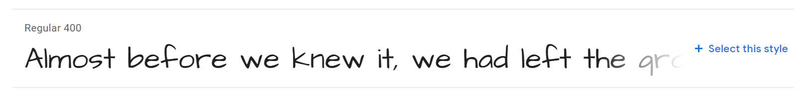

<div class="content-links">
<a target="_blank" href="../customizing-mixtape-slides.html" class="btn btn-outline-secondary">Slideshow</a>
</div>
# Customizing Mixtape

## App starter kit

Now it's time to apply what you've learned to complete your app!

Fork the [repl](https://repl.it/@datadesigns/mixtape) to get started.


<iframe height="1000px" width="100%" src="https://repl.it/@datadesigns/mixtape?lite=true&outputonly=1" scrolling="no" frameborder="no" allowtransparency="true" allowfullscreen="true" sandbox="allow-forms allow-pointer-lock allow-popups allow-same-origin allow-scripts allow-modals"></iframe>


## Python code overview

Let's take a quick look at the `.py` files in the repl; most of it should look familiar, or similar to what we've seen before.

- `main.py` serves a `flask` app with a single page, and does some processing for `POST` requests
- `auth.py` has somewhere to put an `access_token` should we want to
- `mixtape.py` contains `tracks_detail`, which is imported into `main.py` and used by `render_template()` 
- `tracks.py` has functions to fetch data from the Spotify API, and to extract summary information from it
- `votes.py` has `reset_votes()` and `log_user_choice()` functions, which modify the `replit` database


## Templates overview

- our `flask` app will use the `index.html` template to create our page
- the header and footer can be modified within `base.html`
- `index.html` uses `{% include ... }` to incorporate `top_section.html` and `tracks_section.html`
- `top_section` has no Jinja templating logic, i.e. dynamic elements to it
- `tracks_section` has Jinja statements for the voting buttons but not track information

## Things to do

First of all, work in `mixtape.py`:

- use the `tracks.get_track_data()` function with a valid `access_token` and some `track_id`s of your choice to **fetch data from Spotify** (six is a good number of tracks)
- write this data to the **`replit` database** so it can be retrieved in future without needing to request from the API again
- use `tracks.track_summary()` to **extract data to display** on the page, assigning it to `tracks_detail`

Then, work in `tracks_section.html`:

- **modify the template** to display this data in the cards using Jinja statements

Finally, see if you can add some different styling to the app. We'll take a look at how to do this now.


## Bootstrap styling

You'll notice in `base.html` that several **stylesheets** are imported, and that these can be found in the `/static` folder. 

- `bootstrap.css` was generated using the [bootstrap.build](https://bootstrap.build/themes) service, using the [Sandstone theme](https://bootstrap.build/app/project/UroRGaxfXxdg)
    - the `_variables.scss` file allows you to retainany customizations made with the tool
- the [Album](https://getbootstrap.com/docs/4.0/examples/album/) example from the Bootstrap site was used as a basis for the page design and its CSS is in `album.css`  
- `custom.css` includes some further customizations, to fonts and the design of the cards

## Google fonts

Take a look at `custom.css`; at the top you'll see several `@import` statements, and then references to the imported fonts in the `font-family` attributes of some of the CSS class declarations:

```css
h1, h2 {
     font-family: 'Rock Salt', cursive;
     ...
}
```



- we can get `@import` statements and associated `font-family` values for numerous other fonts from [Google Fonts](https://fonts.google.com/)

## CSS variables

```css
h1, h2 {
     ...
     color: var(--dark);
}
```

- notice the use of a **CSS variable** to apply the `--dark` color (defined in and **inherited** from `bootstrap.css`)
