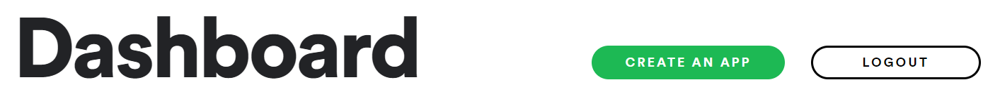

<div class="content-links">
<a target="_blank" href="../requests-auth-slides.html" class="btn btn-outline-secondary">Slideshow</a>
</div>
# Accessing web APIs with `requests`

## Authorization

Most APIs require users to **identify** themselves, and have **limits on the volume and frequency of requests** each user can make, in order to:

- prevent excessive or malicious use overloading the server
- ensure the API remains available for genuine users

This typically requires users to register, upon which they're provided with **credentials**, typically in the form of a unique `id` and an accompanying `key` or `secret`.

### Obtaining Spotify API credentials

We'll be using the **Spotify API** throughout the tutorial. In order to use it, you'll need a Spotify account. 

[Log in or sign up (free)](https://developer.spotify.com/dashboard/)

Follow `CREATE AN APP` from the Dashboard, then copy your `Client ID` and `Client Secret` to somewhere handy. 



### Authentication

In addition to the `id` and `secret` we've just gathered, Spotify requires us to **authenticate** prior to requesting data. 

There are several options available; we'll be using the [Client Credentials Flow](https://developer.spotify.com/documentation/general/guides/authorization-guide/#client-credentials-flow). This will give us access to masses of data about the contents of the Spotify catalogue, but without access to personalized information such as user playlists.

We'll send the `id` and `secret`to the API using a `POST` request, and be sent an `access_token` in the response.

### Obtaining an API `access_token`

The [documentation](https://developer.spotify.com/documentation/general/guides/authorization-guide/#client-credentials-flow) tells us that we'll need to:

- send a `POST` request to `https://accounts.spotify.com/api/token`
- include `'grant_type': 'client_credentials'` in the request **body**
- include `'Authorization' : 'Basic [base64 encoded client_id:client_secret]'` in the **header**

Fortunately, the `requests.post()` and `HTTPBasicAuth` functions will simplify this for us.


### repl.it code snippet

First of all, [fork the repl](https://repl.it/@datadesigns/mixtape-requests-auth). You'll see a file called `.env.example`; replace the credentials with your own, and change the filename to `.env`

- *`.env` files aren't shared when a fork of a repl is made; they allow you to store values you don't want to share*

`main.py` will be executed when you hit `Run`. If all is well, you should see a dictionary printed in the console below.


<iframe height="800px" width="100%" src="https://repl.it/@datadesigns/mixtape-requests-auth?lite=false" scrolling="no" frameborder="no" allowtransparency="true" allowfullscreen="true" sandbox="allow-forms allow-pointer-lock allow-popups allow-same-origin allow-scripts allow-modals"></iframe>


## Code walkthrough

Let's go through `main.py` and see what happened...

### Accessing our credentials


```python
import requests
from requests.auth import HTTPBasicAuth
import os

client_id = os.getenv("CLIENT_ID")
client_secret = os.getenv("CLIENT_SECRET")
```

- we imported the `requests` and `os` packages, and the `HTTPBasicAuth` submodule
- we used the `.getenv()` method to collect our credentials from the `.env` file

### Defining components for the request

We can use the Python `help()` function to see the docstring for `requests.post()`:


```python
help(requests.post)
```

    Help on function post in module requests.api:
    
    post(url, data=None, json=None, **kwargs)
        Sends a POST request.
        
        :param url: URL for the new :class:`Request` object.
        :param data: (optional) Dictionary, list of tuples, bytes, or file-like
            object to send in the body of the :class:`Request`.
        :param json: (optional) json data to send in the body of the :class:`Request`.
        :param \*\*kwargs: Optional arguments that ``request`` takes.
        :return: :class:`Response <Response>` object
        :rtype: requests.Response
    


```python
url = 'https://accounts.spotify.com/api/token'
data = {'grant_type': 'client_credentials'}
auth=HTTPBasicAuth(client_id, client_secret)
```

- our `url` is the one given by the API documentation
- `data` is the `parameter:value` pair required to be in the body
- `auth` is an optional **keyword argument**
- the `HTTPBasicAuth` method has done the required **encoding** and **formatting** of the credentials for us

### Making a `POST` request


```python
response = requests.post(url, data=data, auth=auth)
response.ok
```

- we used the `.post()` method of `requests` with the arguments we had defined, assigning the returned object to `response`

- the `.ok` attribute of the `Response` object is `True`, meaning that the response was successful

### Accessing response data


```python
response.json()
```

```{.python .nb-output}
    {'access_token': 'BQA5XobojGmQ22qGfcf1XSX1xTJD6pH6oeltC5HtX5fML8ps_uDp1U74ybc5M45CmmRf8DX8FAFjOivOae4',
     'token_type': 'Bearer',
     'expires_in': 3600,
     'scope': ''}
```

- the `.json()` method of the `response` object returned by the API converts the included **JSON object** into a Python dictionary
- the `key:value` pairs include the `access_token` we need; highlight and right-click it to copy (usual shortcuts don't work in the console)
- also note the `expires_in` value - this is the time in seconds (i.e. one hour) that the token will remain usable for

### Status codes


```python
response.status_code
```

```{.python .nb-output}
    200
```

The `.status_code` attribute indicates whether the request was successful, and if not, what went wrong.

- in short, `200` is good news, as is anything in the `200`s 
- codes in the `400`s typcially indicate an issue with your code or parameters
- codes in the `500`s indicate something is malfunctioning on the server

[More about response codes](https://developer.mozilla.org/en-US/docs/Web/HTTP/Status)

## JSON data structures

JSON (**JavaScript Object Notation**) is the most popular data format used by web APIs.

Fortunately for Python programmers, it is fairly straightforward to map JSON to equivalent Python data structures, data types and values (and as shown above, modules which can do this for us).

- **JSON objects** are much like **Python dictionaries**, with comma-separated `key:value` pairs inside `{` braces `}`
- **JSON arrays** are much like **Python lists**, with an ordered collection of comma-separated values inside `[` brackets `]`

The JSON values `true`, `false` and `null` are equivalent to the Python values `True`, `False` and `None` respectively.
