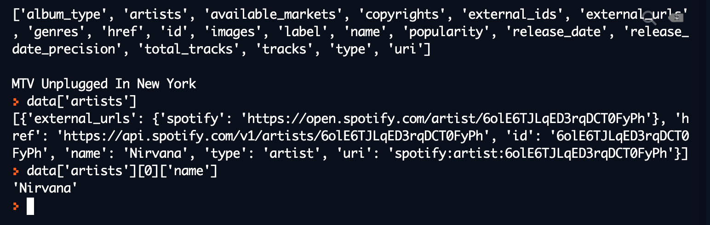

<div class="content-links">
<a target="_blank" href="../requests-get-data-slides.html" class="btn btn-outline-secondary">Slideshow</a>
</div>
# Getting data with `requests`

## Undertanding the API structure

Our first port of call should be the [documentation](https://developer.spotify.com/documentation/web-api/reference/) - take a look around the sections in the **API Endpoint Reference**.

You'll discover:

- the `base_url` for the API is `https://api.spotify.com/v1`
- various endpoints which accept `GET` requests, such as:

    `https://api.spotify.com/v1/recommendations`  
    `https://api.spotify.com/v1/artists/{id}`

Looking at the detailed page of each of these endpoints, you'll see a list of the **query parameters** that can (or are required) be provided, as well as the need for authorization details to be provided in the **header**.

Again, `requests` will simplify this process for us.

## Using `requests.get()`

We previously covered how REST APIs typically support `GET` requests, which can be used to **retrieve data** from the API.

### repl.it code snippet

Fork the [repl](https://repl.it/@datadesigns/seeder-requests-get-data) and **copy your `access_token` into `auth.py`** (you'll need to create a new one if it's more than an hour old).


<iframe height="800px" width="100%" src="https://repl.it/@datadesigns/seeder-requests-get-data?lite=true" scrolling="no" frameborder="no" allowtransparency="true" allowfullscreen="true" sandbox="allow-forms allow-pointer-lock allow-popups allow-same-origin allow-scripts allow-modals"></iframe>


## Code walkthrough

Let's go through `main.py` and see what happened...

### Authorization headers


```python
import requests

#replace this with your current client_credentials access_token:
access_token = 'BQCHXEgma0DJzRDlxTeuGYnqT9cdUaW93bC3Nq90adobVSWMDjjcN40n5ZQ0EmYHPVePzp6TJPb3Svvyg24' 

headers = {'Authorization': f'Bearer {access_token}'}
```

- we imported `requests` and assigned our token to `access_token`
- we created a `headers` dictionary, with this `parameter:value` pair:  
    `Authorization: Bearer [access_token]`
    
*Notice that we had to do some work to get the value in the format the API requires (with `Bearer ` before the `access_token`); this is mentioned in the [API documentation](https://developer.spotify.com/documentation/general/guides/authorization-guide/#client-credentials-flow) but wasn't clear to me before Google came to the rescue.*

### URL components


```python
base_url = 'https://api.spotify.com/v1'
endpoint = '/albums/'
identifier = '1To7kv722A8SpZF789MZy7'
full_url = f'{base_url}{endpoint}{identifier}'
```

- the URL is in component parts and combined using an f-string; this will allow us to make further requests to different endpoints more easily

- the value assigned to `identifier` is an `album_id`; these can be found at the end of the URL of any album page on the [Spotify Web Player](https://open.spotify.com/)

### Response data


```python
response = requests.get(full_url, headers=headers)
data = response.json()

print(list(data.keys()), '\n')
print(data['name'])
```

    ['album_type', 'artists', 'available_markets', 'copyrights', 'external_ids', 'external_urls', 'genres', 'href', 'id', 'images', 'label', 'name', 'popularity', 'release_date', 'release_date_precision', 'total_tracks', 'tracks', 'type', 'uri'] 
    
    MTV Unplugged In New York


- we used the `.json()` method on the `Response` object to convert the JSON data into equivalent Python data stuctures
- we took a look at the `list` of `.keys()` in the resulting dictionary
- we fished out the value for the `name` key from the dictionary

## JSON structure and nesting

We learned previously how JSON is made up of the following structures:  

- **JSON objects**, which get converted to **Python dictionaries**
- **JSON arrays**, which get converted to **Python lists**

JSON datasets are often heavily **nested**; by this it's meant that we can expect to encounter instances of these data structures *within* others.

### Example of JSON structure


```python
data['artists']
```

```{.python .nb-output}
    [{'external_urls': {'spotify': 'https://open.spotify.com/artist/6olE6TJLqED3rqDCT0FyPh'},
      'href': 'https://api.spotify.com/v1/artists/6olE6TJLqED3rqDCT0FyPh',
      'id': '6olE6TJLqED3rqDCT0FyPh',
      'name': 'Nirvana',
      'type': 'artist',
      'uri': 'spotify:artist:6olE6TJLqED3rqDCT0FyPh'}]
```

```python
data['artists'][0]['name']
```

```{.python .nb-output}
    Nirvana
```

- the value associated with the `data` key is itself a list of dictionaries (in this case there is only one element in the list, but the structure means that several artists could be accomodated) 


```python
print(data['artists'][0]['external_urls']['spotify'])
```

```{.python .nb-output}
    https://open.spotify.com/artist/6olE6TJLqED3rqDCT0FyPh
```

- to extract the Spotify URL we are getting a value from a dictionary, which is itself a value in another dictionary, which is itself an element in a list, which is itself a value in another dictionary. Phew!

We'll be looking later on at how we can better access nested data returned by our API requests.
    


### The repl.it console

After running the `repl` you forked earlier, you can access the `data` dictionary via the console:



- after running `main.py`, the `data` dictionary (and anything else imported or created) is in memory
- as a Python `repl`, the Python **interpreter** is already running, and we can enter Python commands

## Using query parameters

With our request for data relating to a particular album, the URL itself (with the `{id}` at the end of the endpoint) was sufficient to specify what data we were requesting.

However, we often need to be more specific, and it it's often more appropariate for the API to be structured to deal with such requests through the use of **query parameters**.

Again, fear not - `requests` is here to make life easier for us.

### Example with query parameters

Take a look at the API documentation for [Search](https://developer.spotify.com/documentation/web-api/reference/search/search/). 

You'll notice that values for the `q` (short for 'query') and `type` parameters are *required* - our request will fail if we don't provide them.


```python
params = {'q': 'waterfall', 'type': 'track'}
search_endpoint = '/search'
search_url = f'{base_url}{search_endpoint}'
search_response = requests.get(search_url, headers=headers, params=params)
```

- we assigned a dictionary containing the `parameter:value` pairs to `params`
- we used the `/search` endpoint with the `base_url` we defined previously
- we used our `params` dictionary as the `params` argument in the `GET` request


```python
waterfall_tracks = search_response.json()
print(list(waterfall_tracks.keys()))
print(list(waterfall_tracks['tracks'].keys()))
print(list(waterfall_tracks['tracks']['items'][0].keys()))
```

```{.python .nb-output}
    ['tracks']
    ['href', 'items', 'limit', 'next', 'offset', 'previous', 'total']
    ['album', 'artists', 'available_markets', 'disc_number', 'duration_ms', 'explicit', 'external_ids', 'external_urls', 'href', 'id', 'is_local', 'name', 'popularity', 'preview_url', 'track_number', 'type', 'uri']
```

Again, we see that the returned data structure has a lot of nesting.

- the top-level dictionary has only one key; perhaps at some stage, `type` wasn't a required value and so the returned dataset could also have contained albums, artists, etc
- the keys in the next level relate to the search itself, including data on relevant tracks
    - the `items` value is a list of dictionaries, each containing data about a given track
- each item in this list is a dictionary, some of whose values are also data structures 
 

### Result and rate limits on API requests

APIs will not typically return all items if there are a large number of matches; instead, further calls to the API will be required. You may also encounter limits on the **frequency** or **volume** of requests to an API or particular endpoint.


```python
print(waterfall_tracks['tracks']['total'])
print(waterfall_tracks['tracks']['limit'])
print(waterfall_tracks['tracks']['next'])
```

```{.python .nb-output}
    97307
    20
    https://api.spotify.com/v1/search?query=waterfall&type=track&offset=20&limit=20
```

- given the total number of results, we can see why there is a limit rather than returning all of them :)
- the Spotify API conveniently provides us with an endpoint for the next block of tracks

## Your turn...

Spend some time using  `requests.get()` to fetch data from endpoints listed under `Albums`, `Artists`, `Browse`, `Search`, and `Tracks` in the [documentation](https://developer.spotify.com/documentation/web-api/reference/); all of these can be done using the Client Credentials `access_token` you created earlier.

See if you can create some reuable functions, to do things such as:

- fetching data for a given track, using an `access_token` and a track `id` as arguments
- searching for artists, using an `access_token` and a string of keywords as arguments

For now, don't worry about automatically renewing the `access_token` or diving too deep into the nested data - we'll be looking at that later on.
