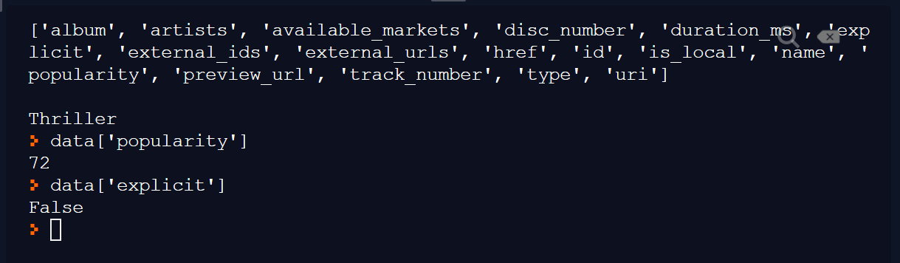

<div class="content-links">
<a target="_blank" href="../requests-get-data-slides.html" class="btn btn-outline-secondary">Slideshow</a>
</div>
# Getting data with `requests`

## API endpoints

Our first port of call should be the [documentation](https://developer.spotify.com/documentation/web-api/reference/){target=_blank} - take a look around the sections in the **API Endpoint Reference**.

You'll discover:

- the `base_url` for the API is `https://api.spotify.com/v1`
- various endpoints which accept `GET` requests, such as:

    `https://api.spotify.com/v1/recommendations`  
    `https://api.spotify.com/v1/artists/{id}`

Looking at the detailed page of each of these endpoints, you'll see a list of the **query parameters** that can (or are required) be provided, as well as the need for authorization details to be provided in the **header**.

Again, `requests` will simplify this process for us.

## Using `requests.get()`

We previously covered how REST APIs typically support `GET` requests, which can be used to **retrieve data** from the API.

### repl.it code snippet

Fork the [repl](https://repl.it/@datadesigns/mixtape-requests-get-data){target=_blank} and **copy your `access_token` into `main.py`** (you'll need to create a new one if it's more than an hour old).


<iframe height="800px" width="100%" src="https://repl.it/@datadesigns/mixtape-requests-get-data?lite=true" scrolling="no" frameborder="no" allowtransparency="true" allowfullscreen="true" sandbox="allow-forms allow-pointer-lock allow-popups allow-same-origin allow-scripts allow-modals"></iframe>


## Code walkthrough

Let's go through `main.py` and see what happened...

### Authorization headers


```python
import requests

#replace this with your current client_credentials access_token:
access_token = 'BQDNokgFn6wBLEpB1NPe-dhG4g29OWnLCPrRZGZvZ-ZlRHGPsi51els1Thy5lARaGkHVikTu4D9gB9XUeus' 

headers = {'Authorization': f'Bearer {access_token}'}
```

- we imported `requests` and assigned our token to `access_token`
- we created a `headers` dictionary, with this `parameter:value` pair:  
    `Authorization: Bearer [access_token]`
    
*Notice that we had to do some work to get the value in the format the API requires (with `Bearer ` before the `access_token`); this is mentioned in the [API documentation](https://developer.spotify.com/documentation/general/guides/authorization-guide/#client-credentials-flow){target=_blank} but wasn't clear to me before Google came to the rescue.*

### URL components


```python
base_url = 'https://api.spotify.com/v1'
endpoint = '/tracks/'
identifier = '7azo4rpSUh8nXgtonC6Pkq'
full_url = f'{base_url}{endpoint}{identifier}'
```

- the URL is in component parts and combined using an f-string; this will allow us to make further requests to different endpoints more easily

- the `identifier` value is a `track_id`; you can get these from the  [Spotify Web Player](https://open.spotify.com/){target=_blank}:  

    - right-click on any **song title**
    - click `Share` then `Copy Song Link`
    - the `track_id` is the final part of the URL

### Response data


```python
response = requests.get(full_url, headers=headers)
data = response.json()

print(list(data.keys()), '\n\n', data['name'])
```

    ['album', 'artists', 'available_markets', 'disc_number', 'duration_ms', 'explicit', 'external_ids', 'external_urls', 'href', 'id', 'is_local', 'name', 'popularity', 'preview_url', 'track_number', 'type', 'uri'] 
    
     Thriller


- we used the `.json()` method on the `Response` object to convert the JSON data into equivalent Python data stuctures
- we took a look at the `list` of `.keys()` in the resulting dictionary
- we fished out the value for the `name` key from the dictionary

## JSON structure

We learned previously how JSON is made up of the following structures:  

- **JSON objects**, which get converted to **Python dictionaries**
- **JSON arrays**, which get converted to **Python lists**

JSON datasets are often heavily **nested**; by this it's meant that we can expect to encounter instances of these data structures *within* others.

### Example of JSON structure


```python
data['artists']
```

```{.python .nb-output}
    [{'external_urls': {'spotify': 'https://open.spotify.com/artist/3fMbdgg4jU18AjLCKBhRSm'},
      'href': 'https://api.spotify.com/v1/artists/3fMbdgg4jU18AjLCKBhRSm',
      'id': '3fMbdgg4jU18AjLCKBhRSm',
      'name': 'Michael Jackson',
      'type': 'artist',
      'uri': 'spotify:artist:3fMbdgg4jU18AjLCKBhRSm'}]
```

```python
data['artists'][0]['name']
```

```{.python .nb-output}
    'Michael Jackson'
```

- the value associated with the `data` key is itself a list of dictionaries (in this case there is only one element in the list, but the structure means that several artists could be accomodated) 


```python
print(data['artists'][0]['external_urls']['spotify'])
```

```{.python .nb-output}
    https://open.spotify.com/artist/3fMbdgg4jU18AjLCKBhRSm
```

- to extract the Spotify URL we are getting a value from a dictionary, which is itself a value in another dictionary, which is itself an element in a list, which is itself a value in another dictionary. Phew! 


### The repl.it console

After running the `repl` you forked earlier, you can access the `data` dictionary via the console:



- after running `main.py`, the `data` dictionary (and anything else imported or created) is in memory
- as a Python `repl`, the Python **interpreter** is already running, and we can enter Python commands
